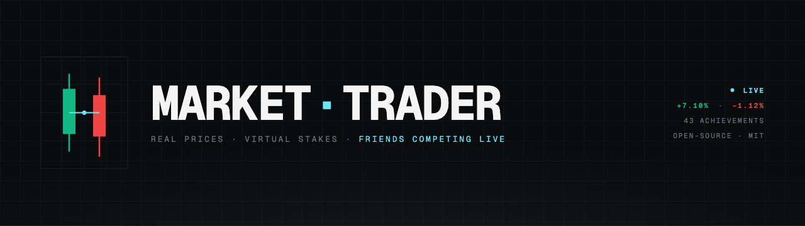
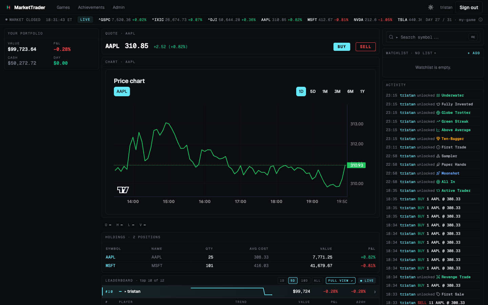
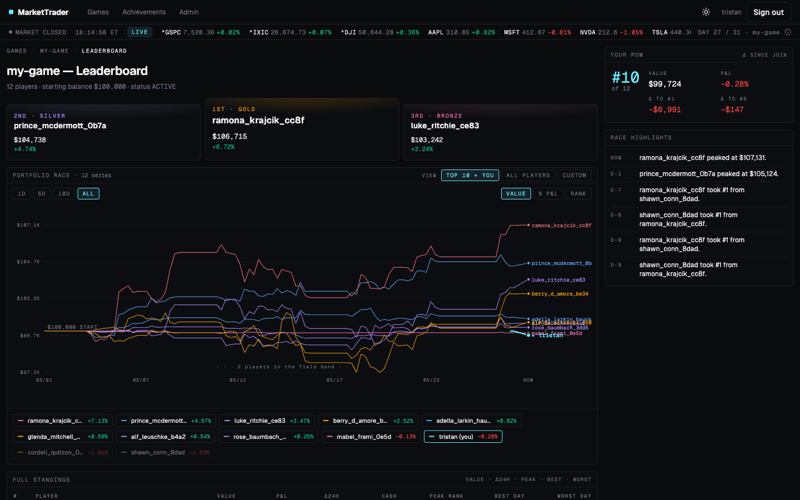
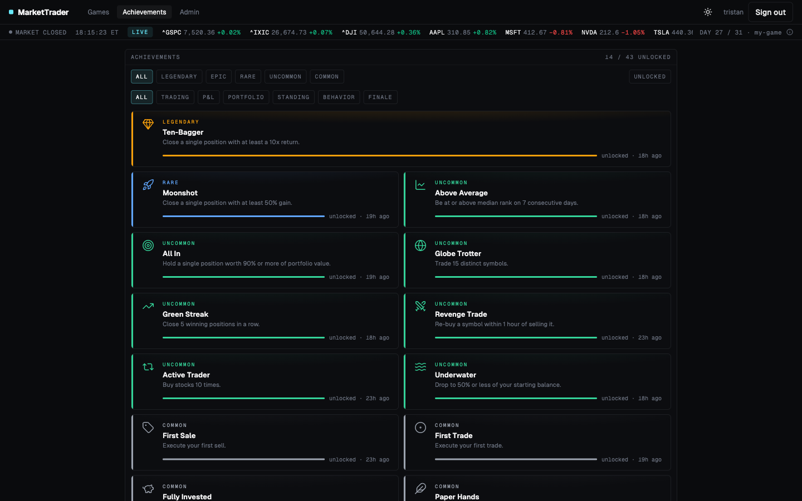

# MarketTrader

A virtual stock trading tournament platform. Groups of friends create a **game**, start with equal virtual cash, and compete to build the most valuable portfolio by trading real stocks at real market prices. A real-time leaderboard tracks rankings throughout the game.



## AI Disclaimer

This project is being developped entirely by an AI (Claude Code). Each commit generated by Claude is signed by Claude. It received minimal human supervision.

Use at your own risk as I make no guarantee about the correctness, security, or reliability of the codebase.

## What It Does

Create a game, invite friends, and trade real stocks at live market prices with virtual cash. The platform tracks portfolio value continuously, broadcasts every leaderboard change over WebSocket, and rewards consistent (or chaotic) play with [43 unlockable achievements](docs/achievements.md) across six categories.

Behind the trading desk: market / limit / stop / stop-limit / bracket orders, GTC time-in-force, watchlists, historical sparklines, light/dark themes, and a full admin panel for operators.

## Features

**Authentication & users**

- Registration and login with JWT access tokens + HttpOnly refresh cookies
- Admin role with elevated permissions across users, games, trades, and audits

**Games**

- Create, join, and list tournaments; status auto-recomputed (`pending` / `active` / `ended`)
- Per-game configurable rules: short selling, allowed order types, starting balance, achievements on/off
- Public "featured games" leaderboards visible without an account

**Trading**

- Five order types: market, limit, stop, stop-limit, bracket (take-profit + stop-loss legs)
- Day or GTC time-in-force; working-order queue with cancel
- Pending-trade and trade-history endpoints; portfolio snapshots updated in real time

**Market data**

- Pluggable `StockProvider` interface (Yahoo Finance default; swap to Alpaca or Polygon via `STOCK_PROVIDER`)
- Live quotes (price, change, change %), OHLC bars, market status (open / closed / pre / after)
- Symbol search and a per-symbol detail page

**Real-time arena**

- Three-pane responsive grid: portfolio, ticker tape, quote header, TradingView chart, holdings, watchlist, activity, leaderboard, symbol search
- Live WebSocket updates for prices, leaderboard ranks, and trade fills
- Collapses to single column on narrow viewports

**Leaderboard**

- Live ranking by total portfolio value
- Per-player sparklines with 1D / 5D / 10D / ALL ranges
- Full leaderboard page with race chart, podium, and detailed standings

**Achievements**

- 43 unlockable badges across six categories (Trading, P&L, Portfolio, Standing, Behavior, Finale) with five rarity tiers from common to legendary
- Two-beat unlock toast with rarity-colored glow, ring pulse, icon flare
- Locked achievements are hidden from the player so unlocks stay surprising — only an "N more locked" tile reveals the count
- See [docs/achievements.md](docs/achievements.md) for the full catalogue with preview images

**Activity feed**

- Merged chronological view of trades and peer achievement unlocks in the arena's right rail
- Persists across reloads via WebSocket connect-time replay
- Idempotent merge so REST seeds and live broadcasts never duplicate

**Admin panel**

- User and game CRUD; portfolio snapshot inspection; trade audit log
- Per-game and platform-wide enable/disable per achievement
- Force-unlock, reset, and set-progress per player + achievement (broadcasts a live toast to the target)
- System view with WebSocket connection count, row counts per table, and price-cache controls

**Resilient transport**

- WebSocket auto-reconnect with exponential backoff and full unacked-unlock replay
- REST seeds dedupe against live WebSocket broadcasts via composite keys

**UX polish**

- Light and dark theme (toggle persisted to localStorage)
- `prefers-reduced-motion` honored across every animation
- Geist Sans + Geist Mono with tabular numerals so currency columns line up

## Tour

> Screenshots may lag behind the latest UI — `pnpm dev` and click around to see the live version.

### Arena



_The main trading view. Portfolio on the left, TradingView chart and holdings down the middle, watchlist and activity feed on the right, live leaderboard underneath._

### Leaderboard



_Race chart traces every player's portfolio value over the game's history. The podium pins the top three; the standings table below carries inline sparklines per player._

### Achievements



_Unlocked cards only — locked achievements stay hidden. The trailing "N more locked" tile tells the player there's more to discover without spoiling the surprise._

## Architecture

```
packages/
  server/     ← Fastify 5 REST API + WebSocket server (Node.js + TypeScript)
  frontend/   ← React 19 + Vite SPA
  shared/     ← TypeScript types only — API contracts shared between server and frontend
```

pnpm workspace monorepo. The `shared` package is the single source of truth for all API types — changes to the API surface produce TypeScript errors in both the server and the frontend before they reach runtime.

## Tech Stack

| Layer               | Choice                         | Why                                                       |
| ------------------- | ------------------------------ | --------------------------------------------------------- |
| Package manager     | pnpm workspaces                | Fast, disk-efficient, strict hoisting                     |
| Server framework    | Fastify 5                      | Lowest overhead, schema-first, async-native               |
| ORM                 | Drizzle ORM                    | Type-safe SQL, zero runtime overhead, dual-dialect        |
| Database (prod)     | PostgreSQL 16                  | ACID, proven at scale                                     |
| Database (dev/test) | SQLite (better-sqlite3)        | Zero setup, in-memory for tests                           |
| WebSocket           | `@fastify/websocket`           | Native Fastify integration, no Socket.io overhead         |
| Auth                | JWT + argon2                   | Short-lived access tokens (15 min), 7-day refresh cookies |
| Frontend framework  | React 19                       | Concurrent features, stable ecosystem                     |
| Build tool          | Vite 6                         | Fastest HMR, native ESM, first-class TypeScript           |
| Charts              | TradingView Lightweight Charts | Purpose-built for financial data                          |
| UI components       | ShadCN/UI + Tailwind CSS       | Copy-own components, utility-first styling                |
| Server state        | React Query v5                 | Caching, background refresh, optimistic updates           |
| Client state        | Zustand                        | Minimal, zero-boilerplate global state                    |
| Stock data          | Pluggable `StockProvider`      | Yahoo Finance default, swap to Alpaca/Polygon via env var |

## Getting Started

### Prerequisites

- Node.js 22+ (an `.nvmrc` is provided — `nvm use` picks it up)
- pnpm (via corepack): `corepack enable`
- Docker (optional, for PostgreSQL in dev)

### Local development with SQLite

```bash
pnpm install
pnpm dev
```

That's it. `pnpm dev` runs a small bootstrap step that:

- Creates `.env` from `.env.example` if missing
- Generates a real `JWT_SECRET` if the value is still the placeholder
- Runs pending Drizzle migrations against `./dev.db`

It then starts the server (`:3000`) and frontend (`:5173`) in parallel. The frontend proxies `/api` to the server, so both services run independently.

The default SQLite client is `@libsql/client` and password hashing uses `@node-rs/argon2`, both of which ship prebuilt napi-rs binaries for Windows, Linux, and macOS — no C/C++ toolchain required.

### Local development with Docker (PostgreSQL)

```bash
cp .env.example .env
# Edit .env — set JWT_SECRET to a real random value

docker-compose up
```

### Running tests

```bash
# All packages
pnpm test

# Watch mode for a single package
pnpm --filter server test:watch
```

Tests use libsql with a file-backed temporary database (unique per test run, cleaned up on process exit) — no env vars needed.

### Type checking and linting

```bash
pnpm typecheck   # All packages
pnpm lint        # All packages
pnpm build       # Full production build
```

### Regenerating achievement docs

```bash
# Requires `pnpm dev` running and an admin account (defaults: tristan / abcd1234).
pnpm docs:achievements
```

Re-captures one preview PNG per achievement and rewrites `docs/achievements.md`.

## Environment Variables

| Variable         | Default                 | Description                                                               |
| ---------------- | ----------------------- | ------------------------------------------------------------------------- |
| `DATABASE_URL`   | `./dev.db`              | Postgres URL (`postgres://...`) or SQLite path. `:memory:` for tests.     |
| `JWT_SECRET`     | —                       | **Required.** Random 64-char hex string. Generate: `openssl rand -hex 32` |
| `PORT`           | `3000`                  | HTTP server port                                                          |
| `CORS_ORIGIN`    | `http://localhost:5173` | Allowed frontend origin                                                   |
| `STOCK_PROVIDER` | `yahoo`                 | `yahoo` \| `alpaca` \| `polygon`                                          |
| `ALPACA_API_KEY` | —                       | Required when `STOCK_PROVIDER=alpaca`                                     |
| `NODE_ENV`       | `development`           | `development` \| `production` \| `test`                                   |

## Where to Learn More

- [`docs/achievements.md`](docs/achievements.md) — every achievement with a preview image, rarity, and target
- [`docs/design.md`](docs/design.md) — feature roadmap and data-model design
- [`docs/technical-decisions.md`](docs/technical-decisions.md) — ADR log; read before swapping a library or pattern
