# Achievements

> Auto-generated by `pnpm docs:achievements`. Do not edit by hand —
> re-run the generator after adding or modifying an achievement.

58 achievements total — 58 enabled, 0 disabled.

## Table of contents

- [Trading](#trading)
- [P&L](#pnl)
- [Portfolio](#portfolio)
- [Standing](#standing)
- [Behavior](#behavior)
- [Finale](#finale)
- [meta](#meta)

## Trading

### Sir, This Is a Wendy's

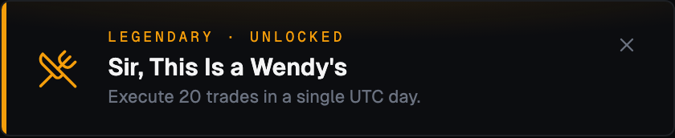

Execute 20 trades in a single UTC day.

| Field | Value |
| --- | --- |
| Key | `sir-this-is-a-wendys` |
| Rarity | Legendary |
| Icon | `utensils-crossed` |
| Target | 20 |
| Enabled | yes |

### Six Seven

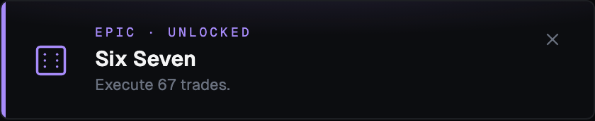

Execute 67 trades.

| Field | Value |
| --- | --- |
| Key | `six-seven` |
| Rarity | Epic |
| Icon | `dice-6` |
| Target | 67 |
| Enabled | yes |

### Market Maker

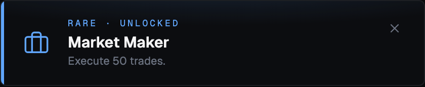

Execute 50 trades.

| Field | Value |
| --- | --- |
| Key | `market-maker` |
| Rarity | Rare |
| Icon | `briefcase` |
| Target | 50 |
| Enabled | yes |

### Active Trader

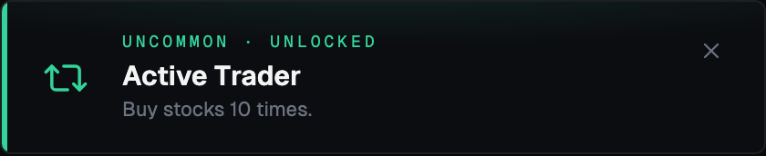

Buy stocks 10 times.

| Field | Value |
| --- | --- |
| Key | `ten-buys` |
| Rarity | Uncommon |
| Icon | `repeat-2` |
| Target | 10 |
| Enabled | yes |

### Day Trader

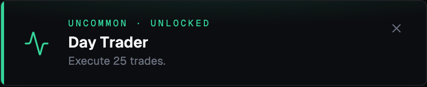

Execute 25 trades.

| Field | Value |
| --- | --- |
| Key | `day-trader` |
| Rarity | Uncommon |
| Icon | `activity` |
| Target | 25 |
| Enabled | yes |

### Globe Trotter

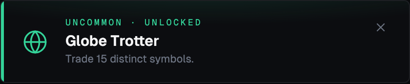

Trade 15 distinct symbols.

| Field | Value |
| --- | --- |
| Key | `globe-trotter` |
| Rarity | Uncommon |
| Icon | `globe` |
| Target | 15 |
| Enabled | yes |

### Tax Loss Harvester

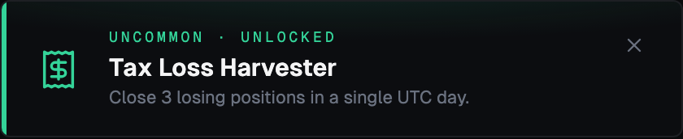

Close 3 losing positions in a single UTC day.

| Field | Value |
| --- | --- |
| Key | `tax-loss-harvester` |
| Rarity | Uncommon |
| Icon | `receipt` |
| Target | 3 |
| Enabled | yes |

### Apprentice

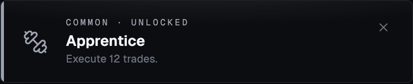

Execute 12 trades.

| Field | Value |
| --- | --- |
| Key | `apprentice` |
| Rarity | Common |
| Icon | `dumbbell` |
| Target | 12 |
| Enabled | yes |

### First Sale

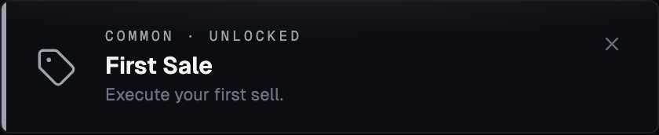

Execute your first sell.

| Field | Value |
| --- | --- |
| Key | `first-sale` |
| Rarity | Common |
| Icon | `tag` |
| Target | 1 |
| Enabled | yes |

### First Trade

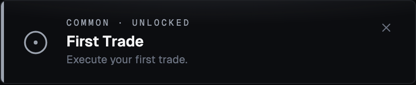

Execute your first trade.

| Field | Value |
| --- | --- |
| Key | `first-trade` |
| Rarity | Common |
| Icon | `circle-dot` |
| Target | 1 |
| Enabled | yes |

### Sampler

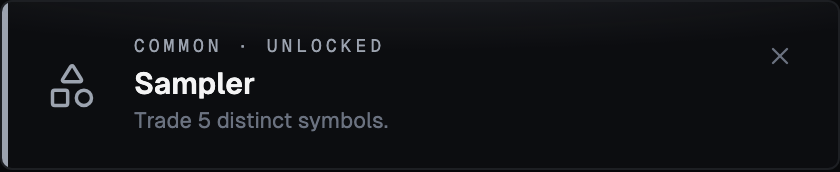

Trade 5 distinct symbols.

| Field | Value |
| --- | --- |
| Key | `sampler` |
| Rarity | Common |
| Icon | `shapes` |
| Target | 5 |
| Enabled | yes |

## P&L

### Diamond-Plated Hands

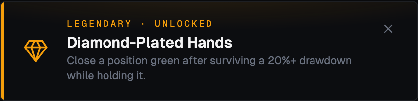

Close a position green after surviving a 20%+ drawdown while holding it.

| Field | Value |
| --- | --- |
| Key | `diamond-plated-hands` |
| Rarity | Legendary |
| Icon | `gem` |
| Target | 1 |
| Enabled | yes |

### Ten-Bagger

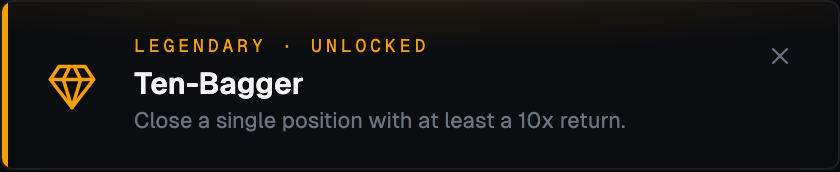

Close a single position with at least a 10x return.

| Field | Value |
| --- | --- |
| Key | `ten-bagger` |
| Rarity | Legendary |
| Icon | `gem` |
| Target | 1 |
| Enabled | yes |

### Triple Threat

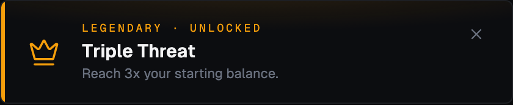

Reach 3x your starting balance.

| Field | Value |
| --- | --- |
| Key | `triple-threat` |
| Rarity | Legendary |
| Icon | `crown` |
| Target | 1 |
| Enabled | yes |

### Double Up

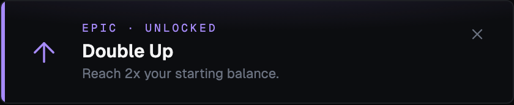

Reach 2x your starting balance.

| Field | Value |
| --- | --- |
| Key | `double-up` |
| Rarity | Epic |
| Icon | `arrow-up` |
| Target | 1 |
| Enabled | yes |

### Speedrun Any %

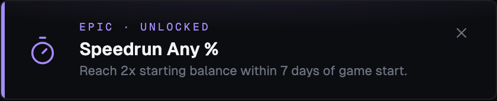

Reach 2x starting balance within 7 days of game start.

| Field | Value |
| --- | --- |
| Key | `speedrun-any-percent` |
| Rarity | Epic |
| Icon | `timer` |
| Target | 1 |
| Enabled | yes |

### Wolf of MarketTrader

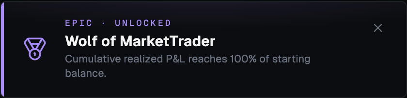

Cumulative realized P&L reaches 100% of starting balance.

| Field | Value |
| --- | --- |
| Key | `wolf-of-markettrader` |
| Rarity | Epic |
| Icon | `medal` |
| Target | 1 |
| Enabled | yes |

### Catastrophe

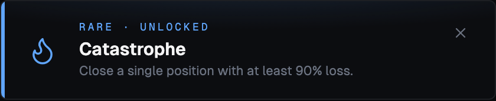

Close a single position with at least 90% loss.

| Field | Value |
| --- | --- |
| Key | `catastrophe` |
| Rarity | Rare |
| Icon | `flame` |
| Target | 1 |
| Enabled | yes |

### Moonshot

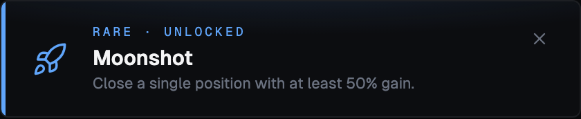

Close a single position with at least 50% gain.

| Field | Value |
| --- | --- |
| Key | `moonshot` |
| Rarity | Rare |
| Icon | `rocket` |
| Target | 1 |
| Enabled | yes |

### Phoenix

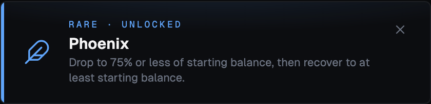

Drop to 75% or less of starting balance, then recover to at least starting balance.

| Field | Value |
| --- | --- |
| Key | `phoenix` |
| Rarity | Rare |
| Icon | `feather` |
| Target | 1 |
| Enabled | yes |

### Round Tripper

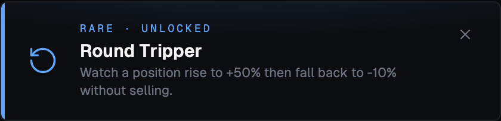

Watch a position rise to +50% then fall back to -10% without selling.

| Field | Value |
| --- | --- |
| Key | `round-tripper` |
| Rarity | Rare |
| Icon | `rotate-ccw` |
| Target | 1 |
| Enabled | yes |

### Bag Holder

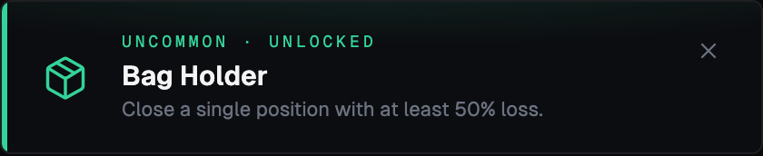

Close a single position with at least 50% loss.

| Field | Value |
| --- | --- |
| Key | `bag-holder` |
| Rarity | Uncommon |
| Icon | `package` |
| Target | 1 |
| Enabled | yes |

### Green Streak

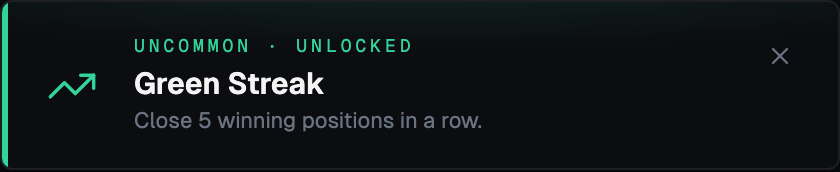

Close 5 winning positions in a row.

| Field | Value |
| --- | --- |
| Key | `green-streak` |
| Rarity | Uncommon |
| Icon | `trending-up` |
| Target | 5 |
| Enabled | yes |

### Locked In

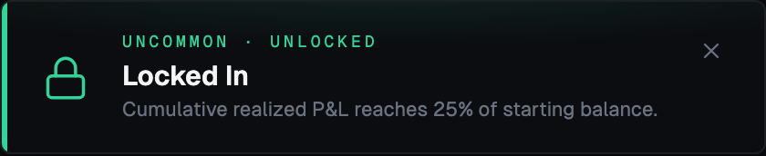

Cumulative realized P&L reaches 25% of starting balance.

| Field | Value |
| --- | --- |
| Key | `locked-in` |
| Rarity | Uncommon |
| Icon | `lock` |
| Target | 1 |
| Enabled | yes |

### Underwater

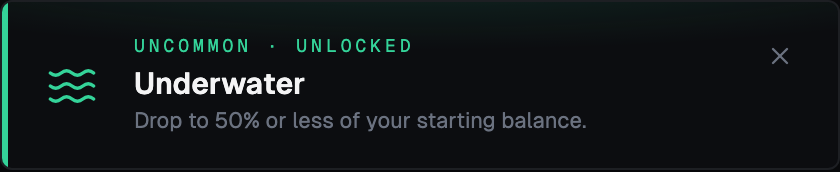

Drop to 50% or less of your starting balance.

| Field | Value |
| --- | --- |
| Key | `underwater` |
| Rarity | Uncommon |
| Icon | `waves` |
| Target | 1 |
| Enabled | yes |

### Buy High, Sell Low

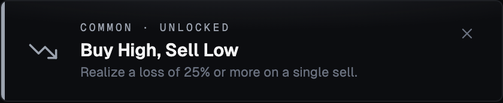

Realize a loss of 25% or more on a single sell.

| Field | Value |
| --- | --- |
| Key | `buy-high-sell-low` |
| Rarity | Common |
| Icon | `trending-down` |
| Target | 1 |
| Enabled | yes |

### First Blood

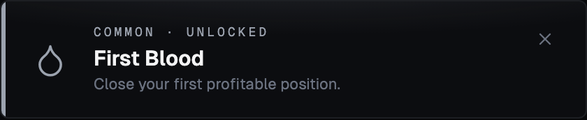

Close your first profitable position.

| Field | Value |
| --- | --- |
| Key | `first-blood` |
| Rarity | Common |
| Icon | `droplet` |
| Target | 1 |
| Enabled | yes |

## Portfolio

### Index Fund

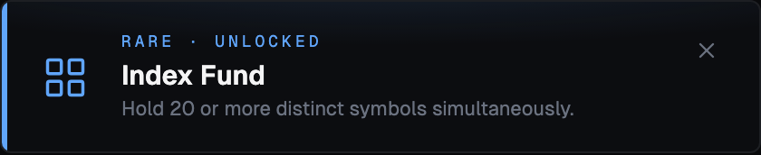

Hold 20 or more distinct symbols simultaneously.

| Field | Value |
| --- | --- |
| Key | `index-fund` |
| Rarity | Rare |
| Icon | `layout-grid` |
| Target | 1 |
| Enabled | yes |

### All In

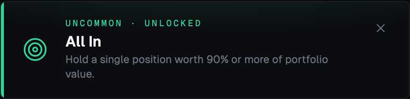

Hold a single position worth 90% or more of portfolio value.

| Field | Value |
| --- | --- |
| Key | `all-in` |
| Rarity | Uncommon |
| Icon | `target` |
| Target | 1 |
| Enabled | yes |

### Cash Is King

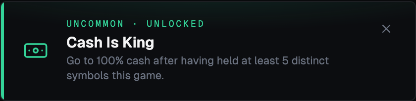

Go to 100% cash after having held at least 5 distinct symbols this game.

| Field | Value |
| --- | --- |
| Key | `cash-is-king` |
| Rarity | Uncommon |
| Icon | `banknote` |
| Target | 1 |
| Enabled | yes |

### Concentrated Bet

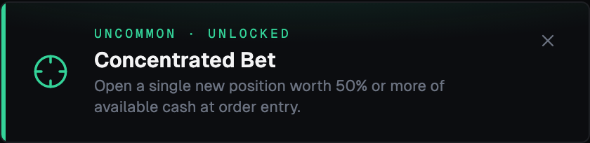

Open a single new position worth 50% or more of available cash at order entry.

| Field | Value |
| --- | --- |
| Key | `concentrated-bet` |
| Rarity | Uncommon |
| Icon | `crosshair` |
| Target | 1 |
| Enabled | yes |

### Diversified

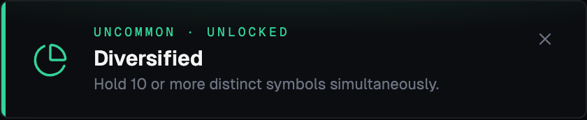

Hold 10 or more distinct symbols simultaneously.

| Field | Value |
| --- | --- |
| Key | `diversified` |
| Rarity | Uncommon |
| Icon | `pie-chart` |
| Target | 1 |
| Enabled | yes |

### Fully Invested

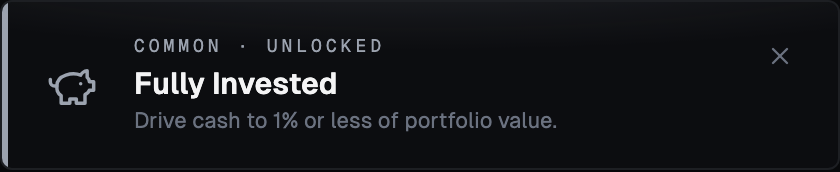

Drive cash to 1% or less of portfolio value.

| Field | Value |
| --- | --- |
| Key | `fully-invested` |
| Rarity | Common |
| Icon | `piggy-bank` |
| Target | 1 |
| Enabled | yes |

## Standing

### Rock Bottom

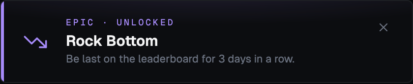

Be last on the leaderboard for 3 days in a row.

| Field | Value |
| --- | --- |
| Key | `rock-bottom` |
| Rarity | Epic |
| Icon | `trending-down` |
| Target | 3 |
| Enabled | yes |

### Untouchable

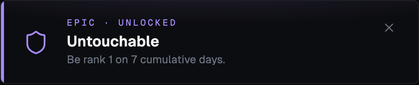

Be rank 1 on 7 cumulative days.

| Field | Value |
| --- | --- |
| Key | `untouchable` |
| Rarity | Epic |
| Icon | `shield` |
| Target | 7 |
| Enabled | yes |

### Comeback Kid

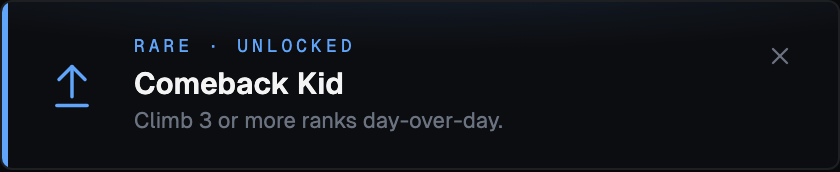

Climb 3 or more ranks day-over-day.

| Field | Value |
| --- | --- |
| Key | `comeback-kid` |
| Rarity | Rare |
| Icon | `arrow-up-from-line` |
| Target | 1 |
| Enabled | yes |

### Reigning Champ

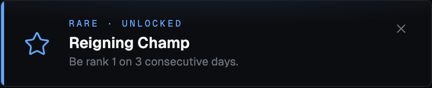

Be rank 1 on 3 consecutive days.

| Field | Value |
| --- | --- |
| Key | `reigning-champ` |
| Rarity | Rare |
| Icon | `star` |
| Target | 3 |
| Enabled | yes |

### Above Average

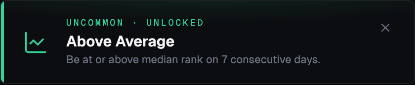

Be at or above median rank on 7 consecutive days.

| Field | Value |
| --- | --- |
| Key | `above-average` |
| Rarity | Uncommon |
| Icon | `chart-line` |
| Target | 7 |
| Enabled | yes |

### Free Fall

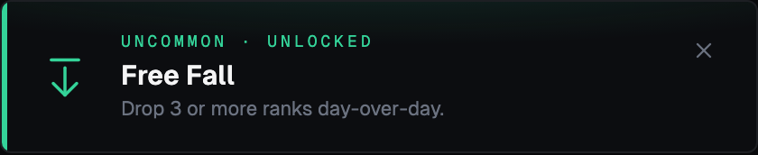

Drop 3 or more ranks day-over-day.

| Field | Value |
| --- | --- |
| Key | `free-fall` |
| Rarity | Uncommon |
| Icon | `arrow-down-from-line` |
| Target | 1 |
| Enabled | yes |

### Podium

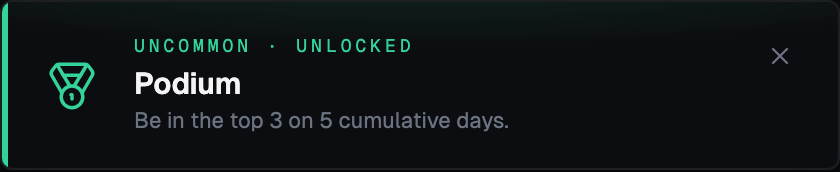

Be in the top 3 on 5 cumulative days.

| Field | Value |
| --- | --- |
| Key | `podium-days` |
| Rarity | Uncommon |
| Icon | `medal` |
| Target | 5 |
| Enabled | yes |

### Top of the Class

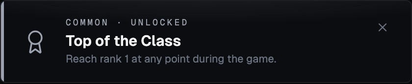

Reach rank 1 at any point during the game.

| Field | Value |
| --- | --- |
| Key | `top-of-the-class` |
| Rarity | Common |
| Icon | `award` |
| Target | 1 |
| Enabled | yes |

## Behavior

### Whale

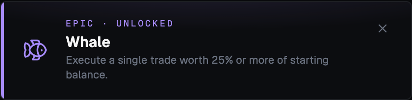

Execute a single trade worth 25% or more of starting balance.

| Field | Value |
| --- | --- |
| Key | `whale` |
| Rarity | Epic |
| Icon | `fish` |
| Target | 1 |
| Enabled | yes |

### Diamond Hands

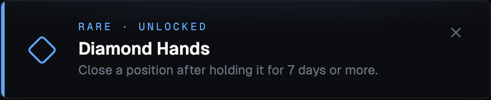

Close a position after holding it for 7 days or more.

| Field | Value |
| --- | --- |
| Key | `diamond-hands` |
| Rarity | Rare |
| Icon | `diamond` |
| Target | 1 |
| Enabled | yes |

### FOMO

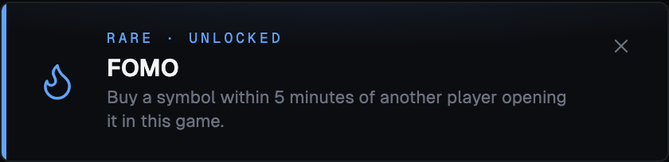

Buy a symbol within 5 minutes of another player opening it in this game.

| Field | Value |
| --- | --- |
| Key | `fomo` |
| Rarity | Rare |
| Icon | `flame` |
| Target | 1 |
| Enabled | yes |

### This Is Fine

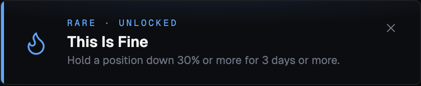

Hold a position down 30% or more for 3 days or more.

| Field | Value |
| --- | --- |
| Key | `this-is-fine` |
| Rarity | Rare |
| Icon | `flame` |
| Target | 1 |
| Enabled | yes |

### HODL

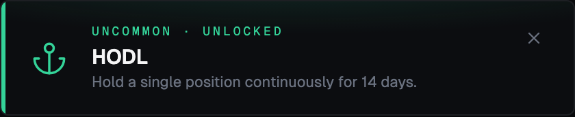

Hold a single position continuously for 14 days.

| Field | Value |
| --- | --- |
| Key | `hodl` |
| Rarity | Uncommon |
| Icon | `anchor` |
| Target | 1 |
| Enabled | yes |

### Penny Stock Enjoyer

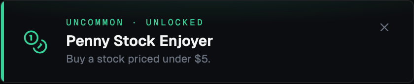

Buy a stock priced under $5.

| Field | Value |
| --- | --- |
| Key | `penny-stock-enjoyer` |
| Rarity | Uncommon |
| Icon | `coins` |
| Target | 1 |
| Enabled | yes |

### Revenge Trade

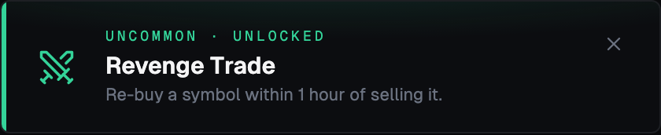

Re-buy a symbol within 1 hour of selling it.

| Field | Value |
| --- | --- |
| Key | `revenge-trade` |
| Rarity | Uncommon |
| Icon | `swords` |
| Target | 1 |
| Enabled | yes |

### Dollar Menu

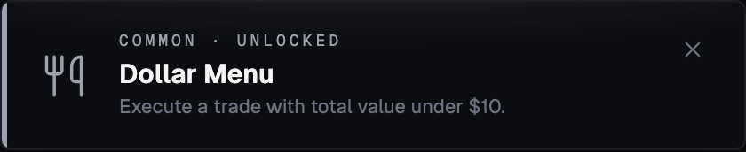

Execute a trade with total value under $10.

| Field | Value |
| --- | --- |
| Key | `dollar-menu` |
| Rarity | Common |
| Icon | `utensils` |
| Target | 1 |
| Enabled | yes |

### One Share Wonder

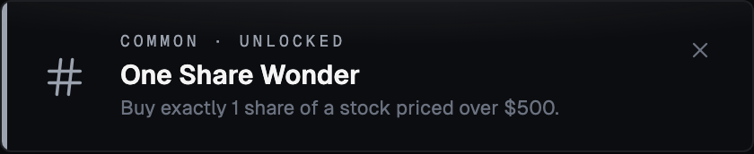

Buy exactly 1 share of a stock priced over $500.

| Field | Value |
| --- | --- |
| Key | `one-share-wonder` |
| Rarity | Common |
| Icon | `hash` |
| Target | 1 |
| Enabled | yes |

### Paper Hands

Close a position less than 5 minutes after opening it.

| Field | Value |
| --- | --- |
| Key | `paper-hands` |
| Rarity | Common |
| Icon | `feather` |
| Target | 1 |
| Enabled | yes |

### Stonks

Hold a position currently up 10% or more.

| Field | Value |
| --- | --- |
| Key | `stonks` |
| Rarity | Common |
| Icon | `trending-up` |
| Target | 1 |
| Enabled | yes |

## Finale

### Wire to Wire

Lead the leaderboard from the first snapshot through the final standings.

| Field | Value |
| --- | --- |
| Key | `wire-to-wire` |
| Rarity | Legendary |
| Icon | `flag` |
| Target | 1 |
| Enabled | yes |

### Champion

Finish the game in 1st place.

| Field | Value |
| --- | --- |
| Key | `champion` |
| Rarity | Epic |
| Icon | `trophy` |
| Target | 1 |
| Enabled | yes |

### Podium Finish

Finish the game in the top 3.

| Field | Value |
| --- | --- |
| Key | `podium-finish` |
| Rarity | Rare |
| Icon | `medal` |
| Target | 1 |
| Enabled | yes |

### Wooden Spoon

Finish last in a game with 3 or more players.

| Field | Value |
| --- | --- |
| Key | `wooden-spoon` |
| Rarity | Uncommon |
| Icon | `utensils` |
| Target | 1 |
| Enabled | yes |

### Honourable Mention

Finish in the top half of the leaderboard (requires 4+ players).

| Field | Value |
| --- | --- |
| Key | `honourable-mention` |
| Rarity | Common |
| Icon | `bookmark` |
| Target | 1 |
| Enabled | yes |

## meta

### Achievement Horse

Unlock more than half of the achievements available in this game.

| Field | Value |
| --- | --- |
| Key | `achievement-horse` |
| Rarity | Legendary |
| Icon | `rosette` |
| Target | 1 |
| Enabled | yes |
